# Aplikacja Webowa Systemu Sprzedaży Biletów

# Wstęp 
Aplikacja Webowa dostępna w niniejszym repozytorium jest częścią większego systemu - System Sprzedaży Biletów. Jednocześnie stanowi jego największą i najbardziej rozbudowaną część. Cały system - projekt, implementacja oraz badania były tematem mojej pracy inżynierskiej.

## Praca inżynierska wraz ze szczegółową dokumentacją oraz wyglądem ekranów aplikacji:
[Praca inżynierska.pdf](./images/Marcin_Krol_System_sprzedazy_biletow.pdf)

# Opis projektu
Aplikacja webowa umożliwia użytkownikom przeglądanie i wyszukiwanie dostępnych wydarzeń, a także wybieranie najlepszych miejsc w sali na podstawie „schematu” miejsc. Po wybraniu biletów, użytkownicy mogą dokonać płatności. Aplikacja umożliwia również organizatorom wydarzeń łatwe dodawanie nowych wydarzeń i zarządzanie sprzedażą biletów poprzez interfejs administracyjny. Organizatorzy mogą także skorzystać z narzędzi analitycznych, aby śledzić sprzedaż biletów i dostosowywać ceny w zależności od popytu. Głównym celem aplikacji jest, aby użytkownicy mogli łatwo i szybko kupować bilety na swoje ulubione wydarzenia, a organizatorzy posiadali pełną kontrolę nad sprzedażą biletów i wglądem do danych analitycznych, które pomogą im w podejmowaniu decyzji biznesowych. 

Część serwerowa: https://github.com/Makolojka/BiletSfera-Server
Część mobilna: https://github.com/Makolojka/BiletSfera-Mobile

***
## Ekrany aplikacji

### Strona główna
<kbd>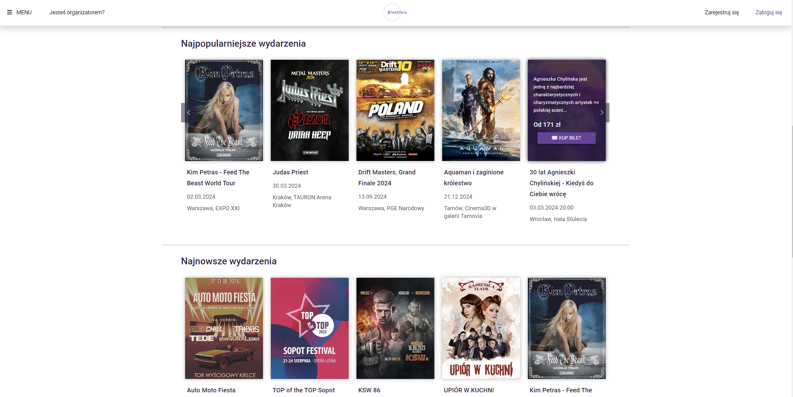</kbd>
***

### Rejestracja/Logowanie
<kbd>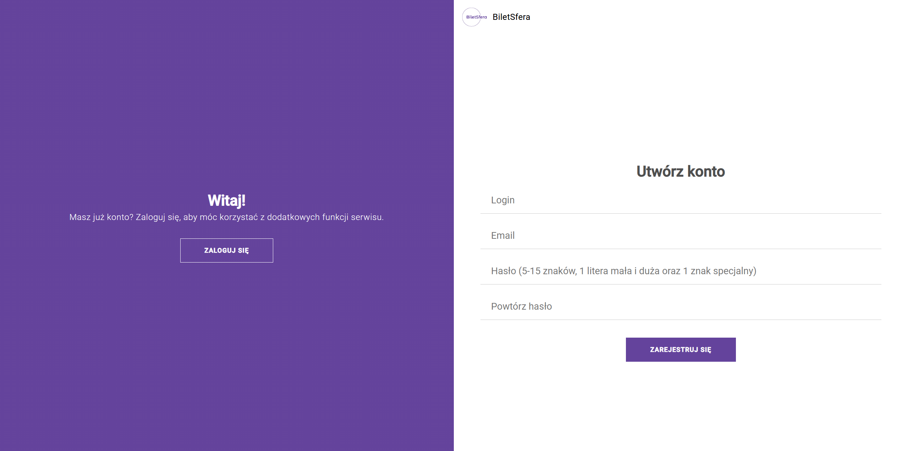</kbd>
***

### Wyszukiwanie
<kbd>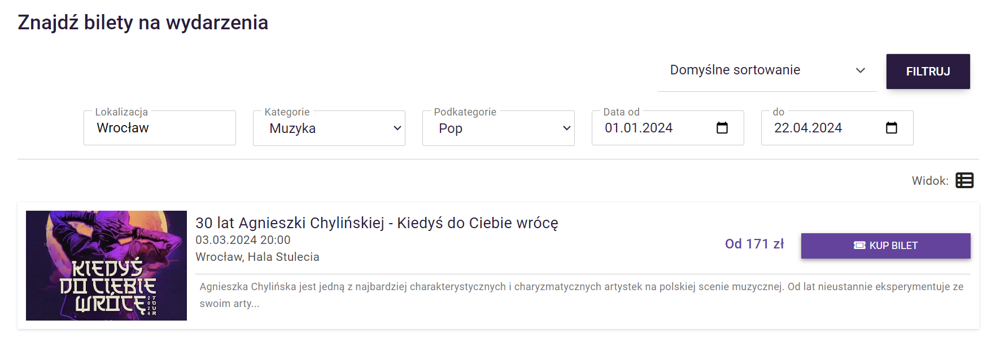</kbd>
***

### Detal wydarzenia
<kbd>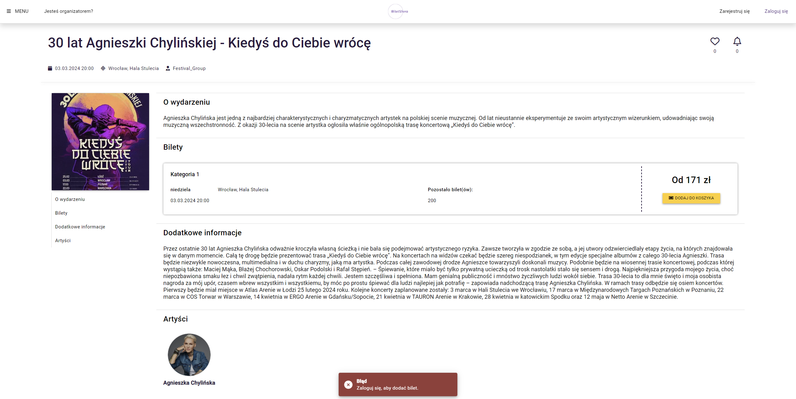</kbd>
***

### Panel użytkownika - Dodawanie biletu do koszyka
<kbd>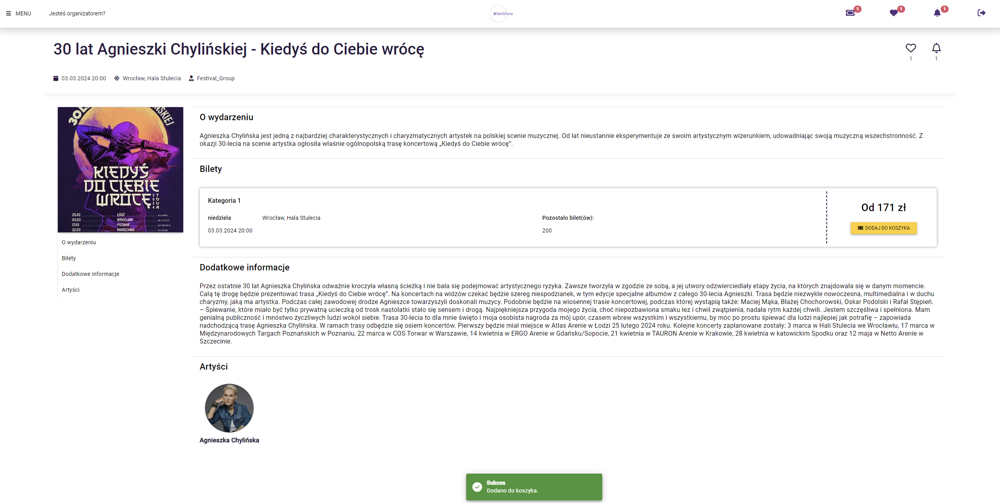</kbd>
***

### Panel użytkownika - Widok koszyka
<kbd></kbd>
***

### Panel użytkownika - Historia transakcji
<kbd>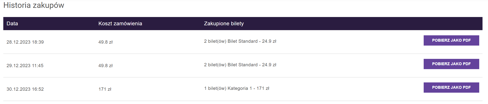</kbd>
***

### Formularz rejestracji organizatora
<kbd></kbd>
***

### Panel organizatora - Przykładowy szablon kina
<kbd>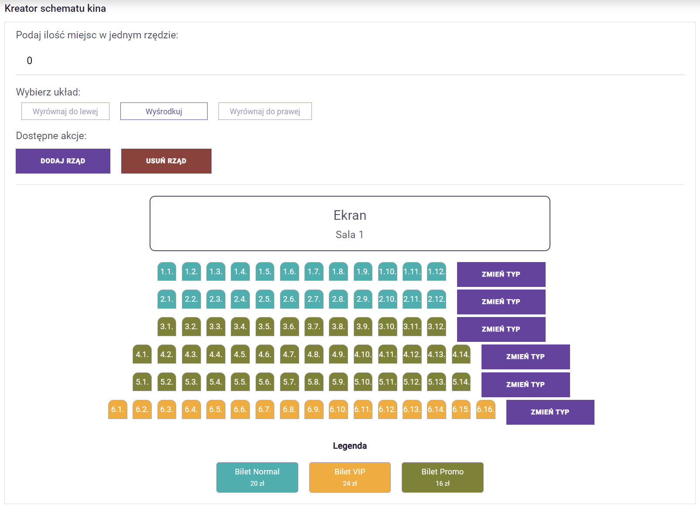</kbd>
***

### Panel organizatora - aktywne wydarzenia
<kbd>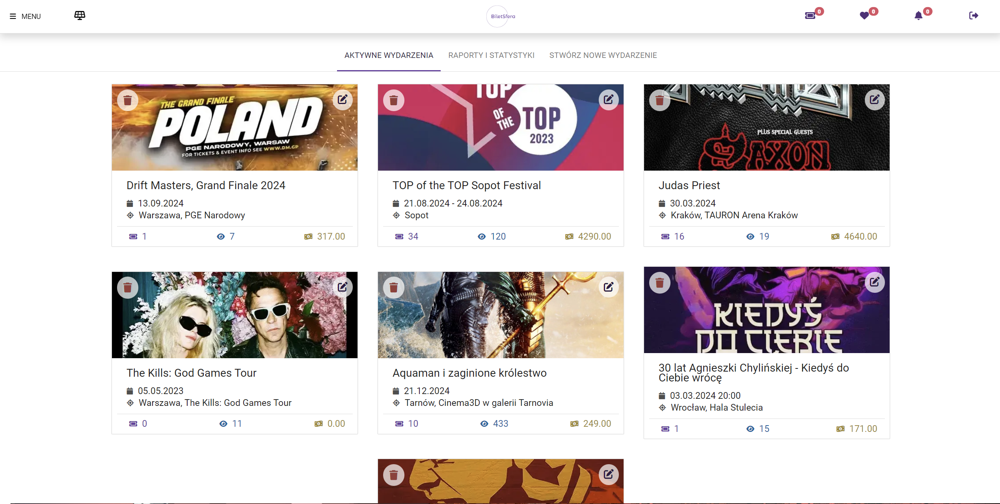</kbd>
***

### Panel organizatora - raporty
<kbd>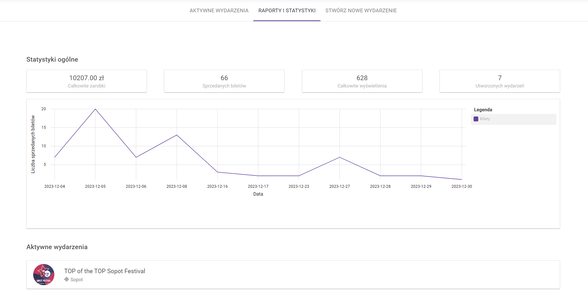</kbd>
***

### Panel organizatora - tworzenie wydarzenia
<kbd></kbd>
***

### Panel organizatora - Wyszukiwanie artystów
<kbd>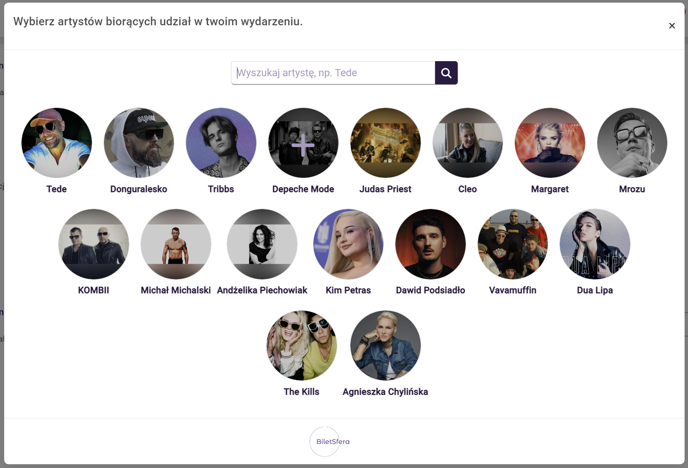</kbd>
***

### Panel organizatora - Widok dodawania/usuwania artystów
<kbd></kbd>
***

# Uruchomienie projektu
Aby, uruchomić projekt należy znajdować się w terminalu w odpowiednim folderze(ścieżce) i wywołać komendę '_npm start_'

Część kliencka dostępna jest pod adresem: 
> http://localhost:4200/

***

## Diagram ERD
<kbd> 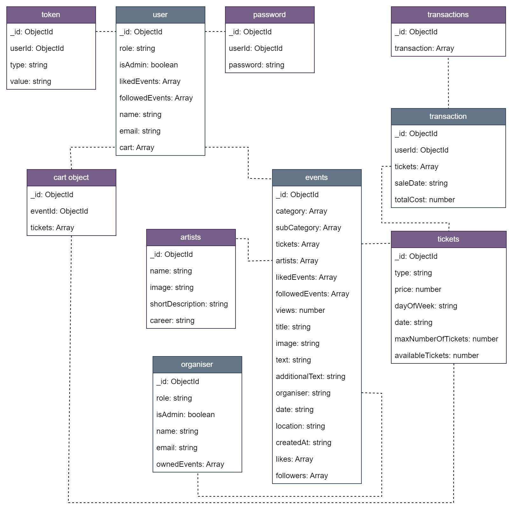 </kbd>

## Dokumentacja API
Szczegółowa dokumentacja API dostępna jest z poziomu interfejsu swagger.io.  
 Po włączeniu serwera dokumentację można znaleźć pod adresem: 
> http://localhost:3001/api-docs/#/ 
> 
> 
***
<kbd> 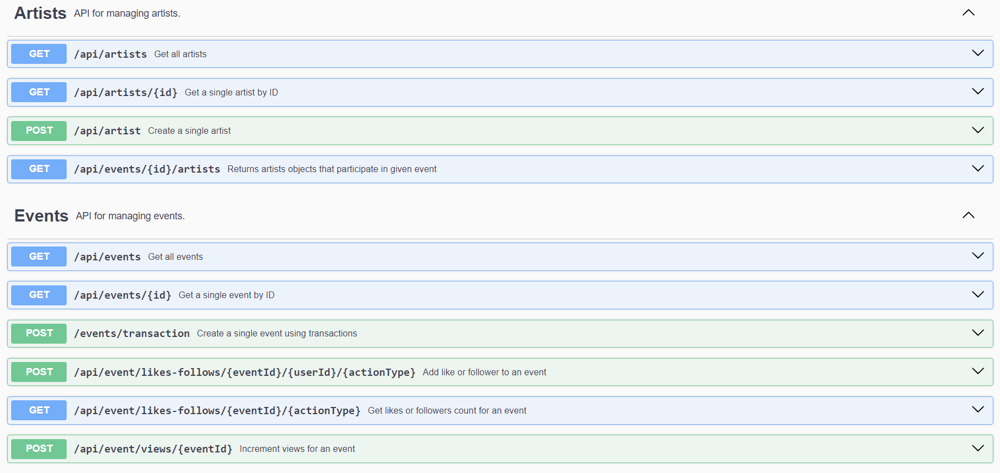 </kbd>
<kbd> 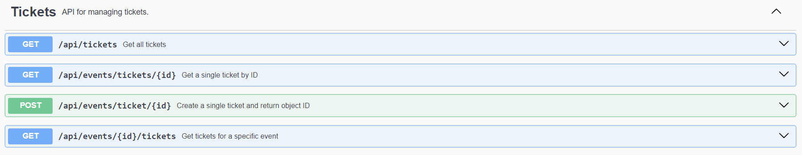 </kbd>
<kbd> 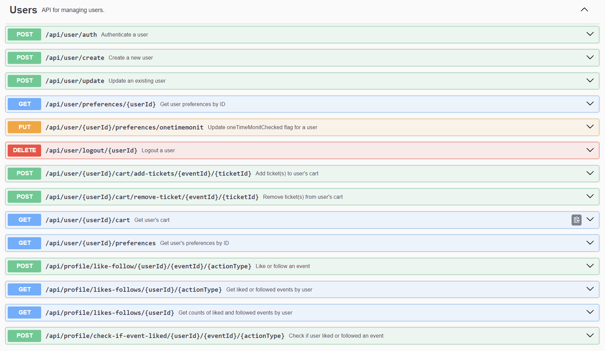 </kbd>
<kbd> 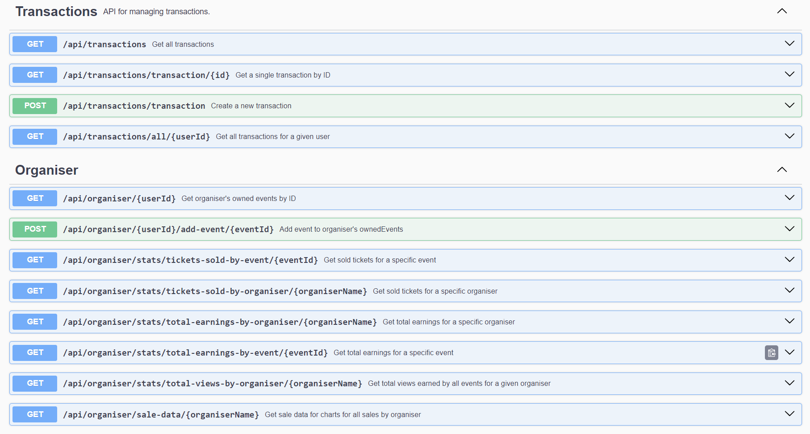 </kbd>
<kbd> 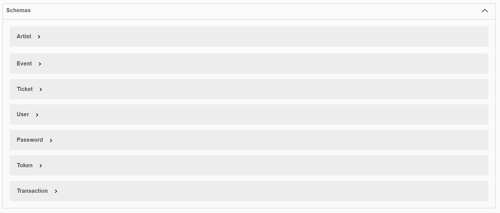 </kbd>

# Technologie użyte w projekcie
- node.js
- express.js
- swagger.io
- angular 16
- mongo.db
- javascript/typescript

***

## Autor
Marcin Król
